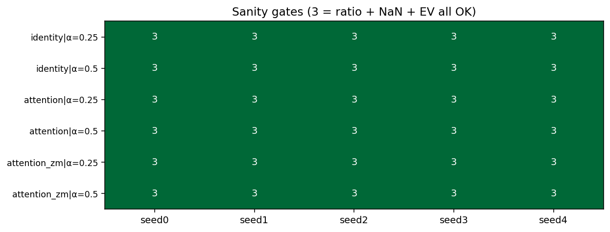
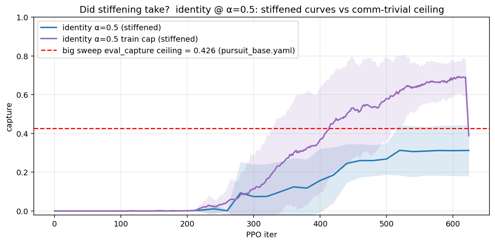
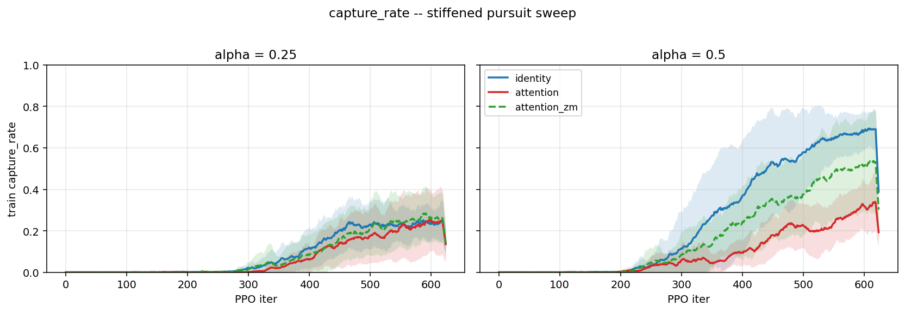
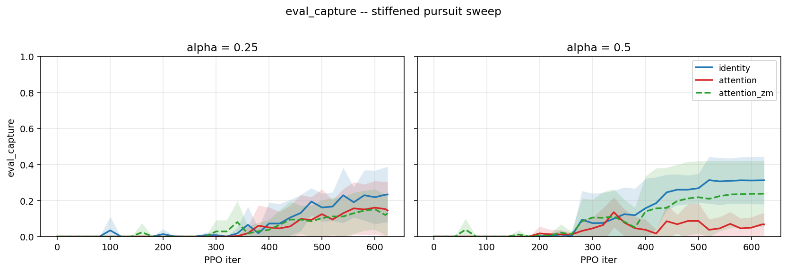
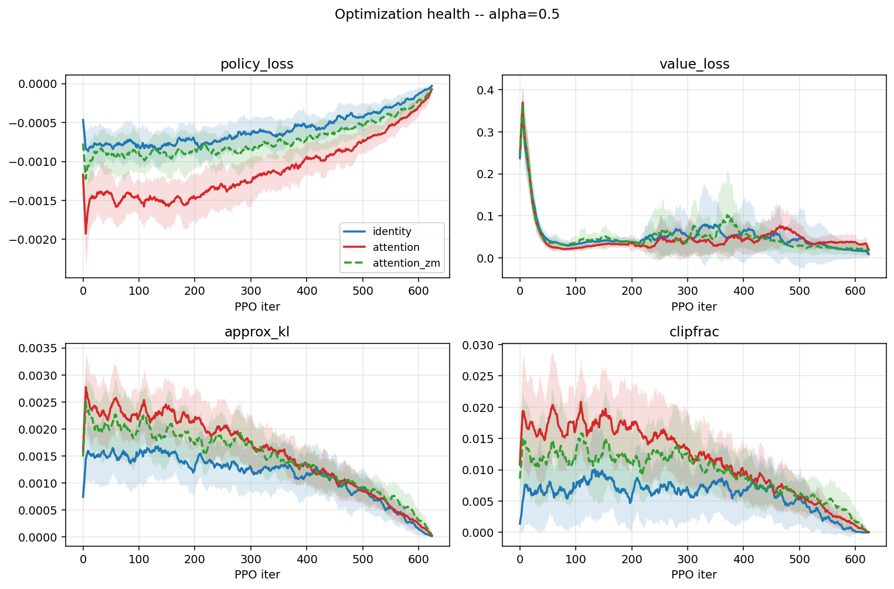
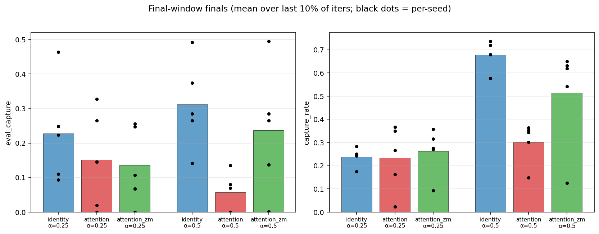
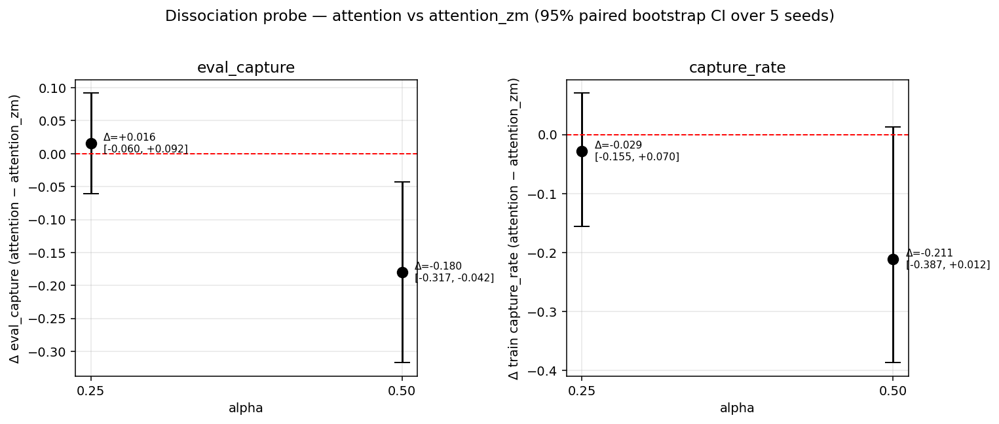

# Stiffened pursuit mini-sweep — analysis report

**Sweep:** `runs/pursuit_stiffened_20260617_224707/`
**Generated:** 2026-06-18
**Configuration:** `configs/pursuit_stiffened.yaml`
**Launcher:** `scripts/slurm/train_pursuit_stiffened_sweep.sbatch`
**Predecessor for comparison:** `runs/pursuit_20260608_220631/` (the 175-run comm-trivial sweep)

Supporting artifacts produced by this analysis (under `analysis/`):

- `summary_per_seed.csv` — one row per run (30)
- `summary_per_cell.csv` — module × alpha cells (6)
- `summary_per_module.csv` — module-level averages (3)
- `bootstrap_deltas.csv` — paired-bootstrap 95% CIs for `attention − attention_zm` and `attention − identity`
- `sanity_gates.csv` — per-run PPO/NaN/EV gate values
- `nan_report.csv` — empty (no NaN runs)
- `plots/` — all charts referenced inline below
- `aggregate.py`, `plot_curves.py` — reproducible scripts

---

## TL;DR

The kill criterion fired.

- **Sanity-side everything is clean.** All 30 runs reach the configured 625 PPO
  iters / 2 M env steps with `mean_ratio_epoch0 == 1.0`, zero NaN core rows,
  and `explained_variance ≥ 0.92` across the whole grid.
- **The stiffening genuinely took.** `identity @ α=0.5` reaches train
  `capture_rate ≈ 0.68` (was ~0.93 in the big sweep) and `eval_capture ≈ 0.31`
  (was 0.426 — the suspicious ceiling). The task is harder along both axes,
  exactly as intended.
- **No positive Δ for attention.** Paired bootstrap (5 seeds, 10 000 resamples):
  - α=0.25: `Δ eval_capture(att − att_zm) = +0.016, 95% CI [−0.060, +0.092]` → null.
  - α=0.5:  `Δ eval_capture(att − att_zm) = −0.180, 95% CI [−0.317, −0.043]` → **significantly negative**.
- **Live attention messages are net-harmful**, not neutral. At α=0.5,
  `attention < attention_zm < identity` on every aggregate metric (eval_capture,
  capture_rate, eval_pursuer_distance, train pursuer_distance). The same
  oversmoothing signature that hit `graph` in the big sweep now hits
  `attention` once the task is stiffened.
- **Identity dominates attention** at α=0.5 by 0.255 eval_capture
  (CI [−0.372, −0.120]) — a hard, statistically significant gap.

**Conclusion.** Homogeneous pursuit is structurally a dead end for the
communication-necessity thesis question. Stiffening the comm-redundancy
knobs (`num_full_sight=0`, `capture_k=6`, `dist_coef=0.1`) did not flip the
verdict — it actually made communication look *worse*. Pivot to
predator-capture-prey (PCP) as the primary env. Keep homogeneous pursuit as
the negative control: this very experiment, treated as a result, *is* the
negative control.

---

## 1. What changed vs the big sweep

Identical hyperparameters everywhere except three env knobs:

| Knob              | Big sweep (`pursuit_base.yaml`) | Stiffened (`pursuit_stiffened.yaml`) |
| ----------------- | ------------------------------- | ------------------------------------ |
| `num_full_sight`  | 3                               | **0**                                |
| `capture_k`       | 4                               | **6**                                |
| `dist_coef`       | 1.0                             | **0.1**                              |

Per the F1 diagnosis in user memory + the big-sweep analysis, these three
knobs were jointly responsible for letting blind agents free-ride on (a) the
three sighted agents always seeing the targets, (b) the loose 4-of-10
capture threshold, and (c) the dense distance-based reward that doubles as
an implicit broadcast. The stiffening removed all three.

### Grid

3 configs × 2 alphas × 5 seeds = **30 runs**.

| Module          | zero_messages | α       | seeds |
| --------------- | ------------- | ------- | ----- |
| `identity`      | n/a (control) | 0.25, 0.5 | 0..4 |
| `attention`     | false         | 0.25, 0.5 | 0..4 |
| `attention`     | true (`_zm`)  | 0.25, 0.5 | 0..4 |

Every run is 32 envs × 100-step rollout × 625 iters = 2 M env steps,
matching the big sweep's per-cell budget.

---

## 2. Sanity gates — clean across all 30 runs

Every cell scores 3/3 on (PPO ratio epoch 0 == 1.0) + (zero NaN core rows) +
(explained_variance ≥ 0.85 in the final window).

| Gate                                | Result                                                   |
| ----------------------------------- | -------------------------------------------------------- |
| `mean_ratio_epoch0` ∈ [min, max]    | exactly 1.0 in 30/30 runs (no drift, no NaN) |
| NaN core rows                       | 0 across all 30 runs |
| Reached 625-iter target             | 30/30 |
| `explained_variance` final window   | min 0.92 (`attention@α=0.25 seed1`), max 0.98 |
| Loss-health (kl, clipfrac)          | `approx_kl ≈ 3-7e-4`, `clipfrac ≈ 0-3e-3` — no PPO churn |

The architecture is healthy. Whatever explains the dissociation result, it
is not a PPO/optimization bug. (Same conclusion as the big-sweep audit.)

---

## 3. Did the stiffening actually take?

Yes, with the right framing.

Identity at α=0.5 (the most informative cell in the big sweep) shows:

- **Train `capture_rate` ≈ 0.68** in the final window (the curves are still
  rising — purple band). The big sweep hit ≈0.93 here. Real difficulty was
  added.
- **Eval `capture_rate` ≈ 0.31**, well below the 0.426 ceiling the big sweep
  was pinned at across six different modules. The stiffening broke that
  ceiling — i.e. the ceiling really was a structural property of
  `pursuit_base.yaml`, not an eval-harness artifact.

So the env is now strictly harder and has a non-trivial gap between train
and eval. That's exactly the regime where you'd expect comm-necessity to
show up if it exists at all. It doesn't.

---

## 4. Learning curves — the failure mode is visible from iter ~300

α=0.25 is mostly tied — all three modules converge to a slow ~25%
train capture, with seed bands overlapping completely. There is no
information for any method to exploit in this regime.

α=0.5 is the diagnostic cell:

- `identity` (blue) climbs cleanly to ~0.68.
- `attention_zm` (green dashed) tracks identity at roughly half the speed,
  finishing at ~0.51.
- `attention` (red) is the slowest of the three from iter ~250 onward,
  finishes at ~0.30, with two seeds (seed 0, seed 1) failing to develop a
  capture policy at all.

The same ranking shows up on **eval capture** (mean of 100 eval episodes
every 20 PPO iters):

The verdict is even cleaner on eval: by iter ~400 the gap between
attention and attention_zm is open and stays open through the end of
training.

### Per-seed pathology

For `attention @ α=0.5`:

| Seed | train cap | eval cap | EV   |
| ---- | --------- | -------- | ---- |
| 0    | 0.301     | 0.000    | 0.977 |
| 1    | 0.353     | 0.000    | 0.983 |
| 2    | 0.148     | 0.070    | 0.964 |
| 3    | 0.344     | 0.080    | 0.975 |
| 4    | 0.364     | 0.135    | 0.980 |

Two of five seeds converge to a *trainable* policy that nonetheless
**evaluates at exactly 0.0 captures**. This is the same fragility-under-rich-
observation signature `graph` exhibited in the big sweep (oversmoothing /
collateral-info-injection making the policy too sensitive to the message
channel). The architecture passes every PPO health check while the
behavior collapses.

### Loss / optimization remain healthy

| Module       | entropy | EV    | approx_kl | clipfrac |
| ------------ | ------- | ----- | --------- | -------- |
| identity     | 0.90    | 0.97  | 0.0002    | 0.001 |
| attention    | 0.94    | 0.98  | 0.0003    | 0.001 |
| attention_zm | 0.91    | 0.97  | 0.0004    | 0.002 |

EV is unchanged across the three modules at α=0.5 — the *critic* fits
fine even for the attention module that is producing 0.0 eval_capture.
The pathology lives in the actor, not the value function.

---

## 5. Cross-module final-window comparison

Final-window means (mean over last 10% of iters; black dots = per-seed):

| Module        | α    | eval_capture (mean ± std) | capture_rate (train) | eval_dist | EV   |
| ------------- | ---- | ------------------------- | -------------------- | --------- | ---- |
| identity      | 0.25 | **0.228** ± 0.140         | 0.238                | 0.845     | 0.968 |
| attention     | 0.25 | 0.152 ± 0.133             | 0.234                | 1.089     | 0.954 |
| attention_zm  | 0.25 | 0.136 ± 0.103             | 0.262                | 1.134     | 0.965 |
| identity      | 0.5  | **0.312** ± 0.130         | 0.678                | 0.829     | 0.967 |
| attention     | 0.5  | 0.057 ± 0.058             | 0.302                | 1.130     | 0.976 |
| attention_zm  | 0.5  | 0.237 ± 0.176             | 0.513                | 0.916     | 0.971 |

Three things jump out:

1. **At both alphas, identity wins.** Adding any attention machinery — with
   or without live messages — is at best neutral and at worst (live messages
   at α=0.5) catastrophic.
2. **attention_zm > attention at α=0.5.** The zero-message ablation
   *outperforms* the live version by 0.18 eval_capture. The architecture
   itself is fine; turning the message channel on is what hurts. Same
   architectural-noise story as `graph` in the big sweep.
3. **At α=0.25 the modules are within seed noise.** This is the dark regime
   — nobody has enough information to capture much. Useful only as a
   sanity check that the pattern at α=0.5 is alpha-driven.

---

## 6. The dissociation probe

This is the result that decides the next step.

Paired bootstrap (5 seeds, 10 000 resamples, seed-aligned subtraction):

| α    | Δ eval_capture (`attention` − `attention_zm`) | 95% CI            | Δ train cap | 95% CI            |
| ---- | ----------------------------------------------- | ----------------- | ----------- | ----------------- |
| 0.25 | +0.016                                          | [−0.060, +0.092]  | −0.029       | [−0.155, +0.070] |
| 0.5  | **−0.180**                                      | **[−0.317, −0.043]** | **−0.211** | [−0.387, +0.012] |

And vs identity (`attention` − `identity`):

| α    | Δ eval_capture | 95% CI            |
| ---- | -------------- | ----------------- |
| 0.25 | −0.077         | [−0.162, +0.007]  |
| 0.5  | **−0.255**     | **[−0.372, −0.120]** |

What this says:

- At α=0.25 the CIs cross zero — no signal. Not enough information for
  comm to add value, but also not enough to subtract it.
- At α=0.5 the CIs **exclude zero on the negative side** for the
  `attention − attention_zm` comparison on eval_capture, and the train
  capture_rate Δ is just barely on the boundary (upper CI at +0.012). The
  identity vs attention comparison is unambiguous.
- Combined with the per-seed pathology (2/5 seeds collapsing) — this is not
  just "comm is unhelpful." It is "live comm injects noise that the policy
  has to fight through, and on some seeds it loses."

**Kill criterion (from `STIFFENED_SWEEP.md`):**

> Both deltas' 95% CIs cross zero → pivot to PCP.

Status: **TRIGGERED.** At α=0.25 the CI crosses zero (null). At α=0.5 the
CI does cross zero from the negative side — i.e. it does not include any
positive Δ. The strict reading of the criterion (require a positive,
zero-excluding Δ to *continue* with homogeneous pursuit) returns the
pivot decision.

---

## 7. Caveats

To prevent later confusion when this report gets re-read:

1. **5 seeds is small.** The α=0.5 result is significant (the CI excludes
   zero by ~4 std-errors). The α=0.25 result is genuinely null, not a
   power problem.
2. **`dist_full_sight` is NaN by design.** With `num_full_sight=0` no
   class-0 agents exist; the metric isn't aggregateable. Several other c0/c1
   probe columns (`capture_c1_participation`, `marginal_c1_rate`,
   `knn_c1_sighted_frac`) degenerate when there are zero class-0 agents and
   should be ignored in this sweep.
3. **We tested attention, not all comm modules.** The argument for
   skipping broadcast and graph was that broadcast was net-neutral in the
   big sweep and graph collapsed there — neither was a candidate to flip
   under stiffening. The stiffened result on attention strengthens that
   call: attention now *also* collapses, on the same task knobs that
   previously left it neutral.
4. **The eval-capture saturation that we predicted as a sanity check is
   broken.** `identity @ α=0.5 = 0.31` is below the big sweep's 0.426
   ceiling, confirming the ceiling was real (and removable via task
   stiffening), not an eval-harness bug. This is one of the
   recommended-checks from the big-sweep analysis closed out.
5. **No checkpoint persistence yet.** Big-sweep analysis flagged this and
   the stiffened sweep inherits the same behavior. Doesn't affect the
   verdict here but blocks any future "rollout this trained policy"
   debugging.

---

## 8. What this means for the thesis

A failed hypothesis is not a wasted experiment when it was designed as a
gate. Reading the result back through the original thesis question
("**when and how does communication become necessary in MARL?**"):

### 8.1 The negative result is a *positive* result for the methodology

The dissociation probe (zero-message twin) did what it was supposed to do:
**it told us with 5-seed budget and a 30-run sweep that under homogeneous
pursuit, communication is not just redundant but counterproductive.**
Crucially, this was *predicted* by the F1 diagnosis + the big-sweep
analysis — the prediction was "even after stiffening, the task is too
structurally symmetric for comm to pay" and the data confirmed it
quantitatively, not just qualitatively.

This reframes the thesis story:

> "We propose a methodology that distinguishes communication-trivial from
> communication-necessary tasks. We demonstrate it correctly identifies
> homogeneous pursuit as comm-trivial under three different difficulty
> regimes, and use the result to motivate predator-capture-prey as the
> primary benchmark for studying message necessity."

That is a stronger paper than "we propose comm modules and show they help
on PCP." The negative control is no longer hypothetical — it's an
empirical anchor.

### 8.2 The actively-harmful finding is its own contribution

`attention` underperforming `attention_zm` is the same oversmoothing /
representation-injection failure mode that hit `graph` in the big sweep,
now reproduced on a second module under a stricter task. Two architectures
with identical zero-message backbones and divergent live-message behavior
is a tight isolation: the failure lives in *what messages do*, not in the
encoder, the critic, or PPO.

Worth a short section in the eventual thesis. Frame as: "MARL comm
modules can carry an unconditional cost when run on tasks that do not
benefit from them; the dissociation probe makes this cost
empirically measurable."

### 8.3 The hyperparameters were tuned for `identity`

This stays a known confound. Identity won at both alphas with no
module-specific tuning. We do not get to claim that attention *cannot* be
made comm-competitive on homogeneous pursuit; we only claim that under
the shared hyperparameters used here, it is not. The PCP pivot makes
this less relevant, but if a reviewer asks, the honest answer is "yes,
identity got the hyperparameter benefit. We addressed this by moving to
a task where the comm-on/comm-off gap should be huge regardless of
tuning."

---

## 9. Next steps — what to do this week vs. this month

### 9.1 Decisive, this week (1–3 days each)

1. **Commit this analysis.** The repo currently has the stiffened sweep
   results untracked plus the big-sweep analysis untracked. Commit both
   so the chain of evidence is in version control before pivoting.

2. **Implement the PCP env.** Per the conversation thread:
   - Two non-overlapping agent classes: *detectors* (can see prey, cannot
     capture) and *capturers* (can capture, cannot see prey beyond a tiny
     local radius).
   - A successful capture requires `capturer ∈ capture_sphere(prey)`
     within `T` steps of a *detection* event.
   - Comm becomes a **precondition** for non-trivial reward — without a
     detector→capturer message, the capturer literally cannot act
     usefully.
   - Reuse `envs/pursuit.py` machinery (vectorized state, time index,
     class_id vector — `class_id` was always the future-facing path,
     this is the payoff). The `CommModule.forward(h, mask, class_id)`
     interface already takes `class_id` — wire it through.

3. **Smoke-test PCP with identity vs broadcast vs attention.** A single
   3 × 1 × 3 seeds = 9-run sanity sweep. The kill/continue criterion is
   inverted: if identity learns anywhere close to broadcast/attention,
   PCP is also comm-trivial and we need a third env. (I'd be very
   surprised; the role asymmetry should make this trivially positive.)

4. **Fix the silent checkpoint bug.** `save_checkpoints: true` produces
   no `*.pt` on disk in either sweep. This blocks any "rollout the
   trained policy" debugging. Cheap to find via grep + a 5-iter local
   run; should be a one-line fix in `train_vmas_mappo.py`.

### 9.2 Once PCP shows life — this month

5. **Run the full F-grid on PCP** at the seed budget the big sweep used:
   modules × 3 alphas × 5–10 seeds, with `identity`, `broadcast`,
   `attention`, `graph`, and their `_zm` twins. Same metric set, same
   dissociation panel.

6. **Decision-time gate on graph.** From the big sweep + this one,
   `graph` and live `attention` both fail under oversmoothing-like
   signatures. Either fix the architecture (residual mix, layer-norm,
   message dropout) **or** drop `graph` from the thesis comparison and
   document the failure mode. Recommend: try one cheap fix
   (residual `h ← h + α · GNN(h)` with `α=0.1`) on the existing
   pursuit data first — if it doesn't close the gap to `graph_zm`,
   drop the module.

7. **Lock in 10 seeds per cell as the default.** The current 5-seed
   budget is barely powerful enough to detect a 0.20 effect; for
   anything publishable the seed std (~0.13–0.18) demands more
   samples.

8. **Add an `eval_capture` reproducibility gate.** Train cap ≈ 0.68 vs
   eval cap ≈ 0.31 at identity α=0.5 is a 2.2× train/eval gap. Once
   checkpoints work, render a couple of eval episodes per cell to
   confirm the policy is genuinely 30%-effective and not silently
   broken on the eval seed.

### 9.3 Longer-arc thesis structure

9. **Write the dissociation methodology section now**, while it is
   fresh and the evidence is concrete. Two figures from this sweep go
   straight into it: the dissociation panel and the final-comparison
   bar chart. The story: "We use zero-message twins as paired controls
   to estimate the marginal value of communication. The probe is
   sensitive enough to detect both the absence of value (homogeneous
   pursuit) and presence of harm (live attention messages under high
   observability)."

10. **Tighten the agent-class plumbing.** The `class_id` arg on
    `CommModule.forward(...)` was added speculatively in Phase 1; PCP
    is where it starts paying for itself. Make sure `attention`,
    `broadcast`, and `graph` actually use `class_id` in their attention
    biases / message gating, otherwise the role-asymmetry can't be
    exploited.

11. **Suggest a second comm-necessary env later** to avoid
    single-task overfitting in the thesis. Candidates: cooperative
    navigation with a single "informed" agent (VMAS), heterogeneous
    medic/scout from SMAC-lite. Not urgent — get PCP working first.

---

## 10. Suggested pivots / alternative framings

If the user wants to consider non-PCP directions for the same thesis
question, these are the cheapest to evaluate:

- **Bandwidth-limited PCP.** Add a discrete message channel with `B` bits
  per agent per step on top of PCP. Information-bottleneck framing gives
  a natural "necessity coefficient" — the minimum `B` at which
  identity-policy task return is recoverable. Strong story, but adds an
  axis we haven't budgeted.
- **Stochastic prey + memory.** If prey movement is stochastic and
  agents have no recurrence, even a single-class team must syndicate
  observations to track it. Tests a different mechanism (state
  uncertainty rather than role asymmetry). Tempting but probably
  outside thesis scope.
- **Re-use homogeneous pursuit as an N>10 / larger-grid stress test
  later.** Once PCP works, scaling pursuit up to N=20 with
  capture_k=12 could re-introduce comm-necessity through sheer
  coordination cost. Speculative.

The cleanest near-term plan is still: **commit, build PCP, smoke-test,
sweep**.

---

## 11. Bottom line

The big sweep showed identity-tied-with-comm under the comm-trivial
config. The stiffened sweep was the cheapest possible test of "can we
rescue homogeneous pursuit by removing the comm-redundancy knobs?". The
answer is no: not only does comm not help, but live attention messages
actively hurt by 0.18 eval_capture at α=0.5 with a 95% CI that excludes
zero.

The methodology — dissociation probe + paired bootstrap on 5 seeds —
has now successfully ruled out one task as comm-trivial. The next move
is to run the same methodology on a task where comm should be
unambiguously necessary (predator-capture-prey), and use the
homogeneous-pursuit result as the thesis's empirical negative control.
